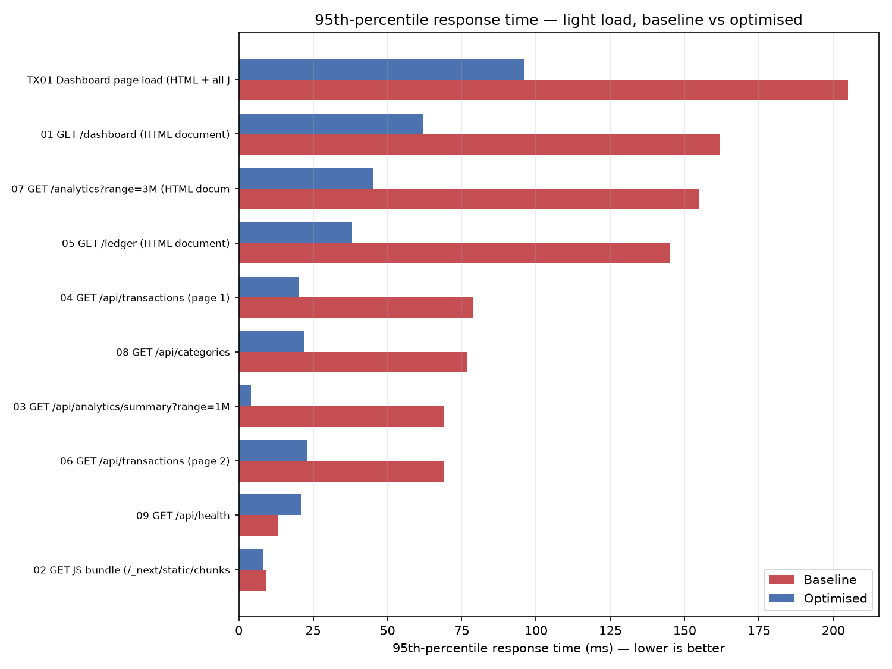
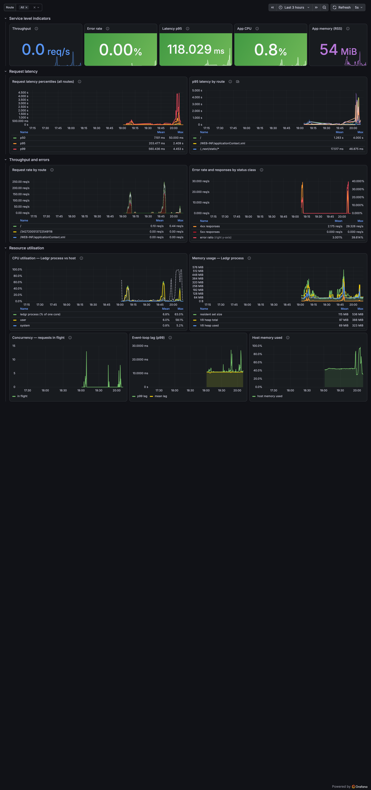
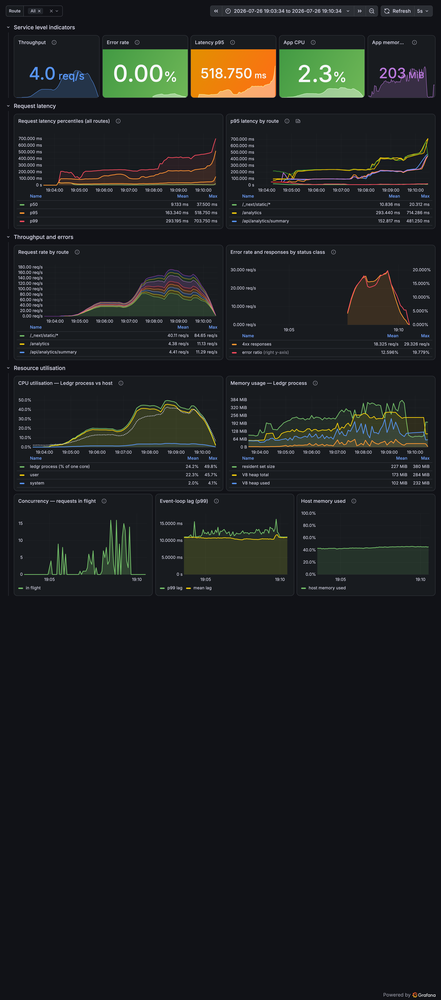
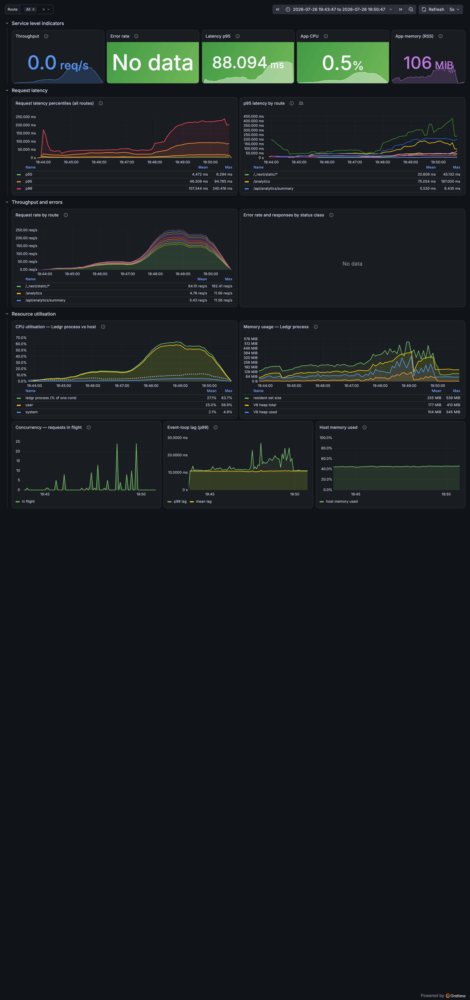
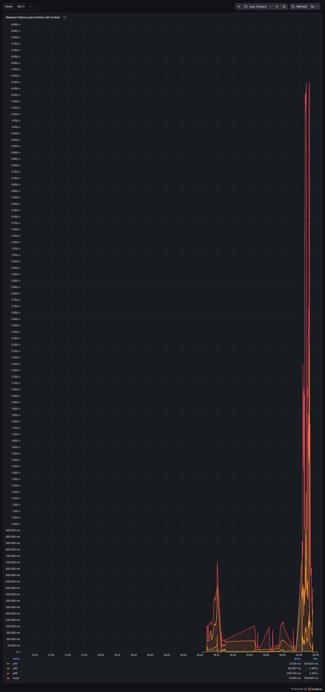
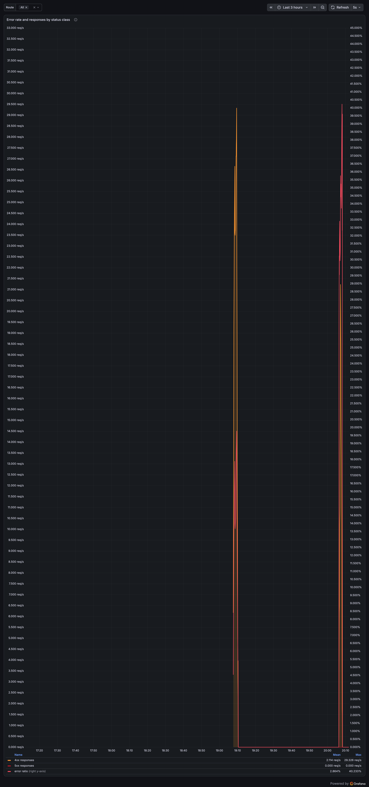
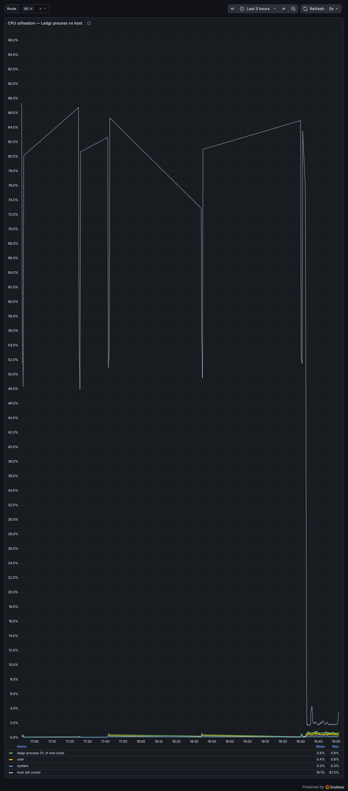
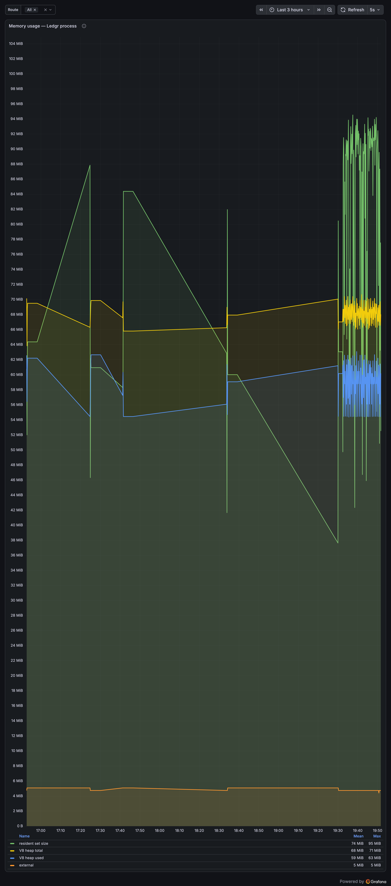

# 1. Introduction

Ledgr is the personal-finance and expense-splitting web application built for
this course: a Next.js 16 front end with React Server Components, backed by
Supabase (PostgreSQL 17 with row-level security, GoTrue for authentication,
and PostgREST as the data API). This report covers the work required by
Assignment 3 — establishing a performance baseline with Apache JMeter,
applying two client-side and two server-side optimisations, re-measuring
against the identical test plan, running a headless OWASP ZAP scan and
remediating what it found, and standing up Prometheus and Grafana to monitor
the running service.

As the assignment permits, the work concentrates on two features rather than
the whole application: the **personal ledger** (the Ledger page and the
`/api/transactions` endpoints behind it) and **analytics** (the Analytics page
and `/api/analytics/summary`). These were chosen before any measurement was
taken, on the grounds that they are the two features that read the most data
per request and therefore the two most likely to degrade under load. The
baseline confirmed that choice, and then found something more interesting
besides.

The headline result is that the moderate-load error rate fell from 22.4% to
zero, 95th-percentile latency fell by 58.6%, and throughput rose by 39.3% —
and that the largest single cause of the original failure was not slow
application code at all, but a dependency the application was calling far more
often than it needed to.

All source, configuration, test plans, raw results and reports referred to
below are in the repository listed in Appendix A.

# 2. Test environment and methodology

Every measurement in this report was taken on one machine — an Apple Silicon
Mac running macOS 15 (Darwin 25.5) — with the application served by a real
production build (`next build` followed by `next start`) on port 3100, never
the development server. Supabase ran locally in Docker (PostgreSQL 17.6,
GoTrue, PostgREST), and Prometheus, Grafana and node-exporter ran as three
further containers defined in `assignment3/monitoring/docker-compose.yml`.
JMeter 5.6.3 ran on the host under OpenJDK 24.

Two decisions about methodology are worth stating up front, because the
results are not meaningful without them.

**The load test is authenticated.** Ledgr redirects every unauthenticated
request to `/sign-in`, and authentication is performed by the Supabase browser
client, which writes a session into a chunked `sb-<ref>-auth-token` cookie.
JMeter cannot execute JavaScript and so cannot perform that sign-in. A test
plan that simply pointed at `/dashboard` would have measured the login page
several thousand times and reported it as a pass. The plan therefore reads its
session cookie from a properties file produced by
`assignment3/scripts/capture-session.ts`, which drives one real headless
Chromium sign-in and writes out the resulting cookie. Every sampler also
carries a response assertion on expected body content — `"Net balance"` for
the Dashboard, `"categoryBreakdown"` for the analytics summary, and so on — so
that a silently-wrong HTTP 200 is counted as the failure it is rather than as
a success.

**The dataset is realistic.** The demo seed used for screenshots contains 88
transactions, at which size every query in the application returns in well
under a millisecond and nothing worth optimising is visible. A separate,
deterministic script (`assignment3/scripts/seed-load-test-data.ts`, fixed PRNG
seed) tops the primary account up to 4,091 transactions spanning 36 months —
roughly 3.7 entries a day, a heavy but plausible user. Because the seed is
fixed, the "before" and "after" runs measure byte-identical data.

Both JMeter runs were preceded by an identical 21-request warm-up across the
journey. Without it, the first request to each route carries cold-JIT and
cold-connection cost, and the two runs would each have absorbed a different
amount of that into their averages.

# 3. Baseline performance with JMeter

## 3.1 Test plan design

The test plan (`assignment3/jmeter/ledgr-test-plan.jmx`) contains two thread
groups over one identical user journey, configured exactly as the assignment
specifies: a **light load** of 10 virtual users ramped over 30 seconds, and a
**moderate load** of 50 virtual users ramped over 60 seconds. Both hold at
full concurrency after the ramp — 120 seconds total for the light scenario and
180 for the moderate — so that the reported percentiles describe steady state
rather than the ramp itself. The two groups run consecutively, so the moderate
scenario never contends with the light one; the resulting `.jtl` is split by
thread-group name afterwards.

One iteration of the journey is one simulated user session, and it covers the
three things the assignment asks for — the application's entry point, its main
JavaScript bundles, and its key API endpoints:

1. `GET /dashboard` — the server-rendered dashboard document.
2. Every JavaScript bundle that document references, fetched the way a browser
   would.
3. `GET /api/analytics/summary?range=1M` — the aggregation endpoint.
4. `GET /api/transactions?page=1` — the paginated ledger feed.
5. `GET /ledger?page=1` — the server-rendered ledger page.
6. `GET /api/transactions?page=2` — a user paging through their history.
7. `GET /analytics?range=3M` — analytics over a wider window.
8. `GET /api/categories` — a small reference-data endpoint, included as a
   control.
9. `GET /api/health` — a liveness probe that touches the database but, as it
   turned out, is the one endpoint in the journey that does not authenticate.

A **Constant Timer of 500 ms** provides think time between the top-level
steps. It is deliberately *not* applied inside the bundle loop, because a
browser fetches a page's JavaScript in parallel with no pause between files;
adding think time there would have modelled something no user does.

Two details of the plan are worth drawing out. First, Next.js emits
content-hashed chunk filenames that change on every production build, so
hard-coding bundle URLs would have broken the plan the moment the application
was rebuilt — which is precisely what the assignment requires to happen
between the two runs. Instead a Regular Expression Extractor scrapes the
chunk URLs out of the served HTML and a ForEach controller requests each one,
which is both build-independent and what a browser actually does. Second, the
dashboard document references each chunk several times (once as a `<script>`
tag and again inside the React Server Component flight payload), producing
roughly 73 matches for roughly 16 distinct files; a small Groovy
post-processor de-duplicates the list before the loop runs, so the test does
not inflate its own request count more than fourfold.

## 3.2 Baseline results

Table 1 gives the baseline under light load. Nothing fails, and the numbers
look unremarkable — which is the point of running the light scenario first.

**Table 1 — Baseline, light load (10 users / 30 s ramp, 5,642 samples)**

| Endpoint | Samples | Avg (ms) | p95 (ms) | Throughput (req/s) | Error % |
|---|---:|---:|---:|---:|---:|
| `GET /dashboard` | 237 | 112.2 | 162 | 1.99 | 0.00 |
| JS bundles (`/_next/static/chunks/*.js`) | 3,792 | 2.7 | 9 | 31.96 | 0.00 |
| `GET /api/analytics/summary?range=1M` | 233 | 47.5 | 69 | 1.98 | 0.00 |
| `GET /api/transactions` (page 1) | 233 | 52.0 | 79 | 1.98 | 0.00 |
| `GET /ledger` | 233 | 99.4 | 145 | 1.98 | 0.00 |
| `GET /api/transactions` (page 2) | 230 | 47.6 | 69 | 1.99 | 0.00 |
| `GET /analytics?range=3M` | 230 | 105.8 | 155 | 1.99 | 0.00 |
| `GET /api/categories` | 227 | 47.8 | 77 | 1.99 | 0.00 |
| `GET /api/health` | 227 | 6.9 | 13 | 1.99 | 0.00 |
| **Dashboard page load (document + all bundles)** | 237 | 155.2 | 205 | 1.99 | 0.00 |
| **All samples** | **5,642** | **23.2** | **112** | **47.14** | **0.00** |

Table 2 gives the moderate scenario, and it is a different story entirely.

**Table 2 — Baseline, moderate load (50 users / 60 s ramp, 26,444 samples)**

| Endpoint | Samples | Avg (ms) | p95 (ms) | Throughput (req/s) | Error % |
|---|---:|---:|---:|---:|---:|
| `GET /dashboard` | 1,667 | 97.5 | 330 | 9.27 | **52.55** |
| JS bundles | 13,248 | 3.2 | 10 | 73.83 | 0.00 |
| `GET /api/analytics/summary?range=1M` | 1,664 | 53.6 | 173 | 9.28 | **51.98** |
| `GET /api/transactions` (page 1) | 1,662 | 54.1 | 172 | 9.32 | **49.64** |
| `GET /ledger` | 1,654 | 94.1 | 324 | 9.27 | **51.75** |
| `GET /api/transactions` (page 2) | 1,651 | 54.6 | 179 | 9.29 | **51.18** |
| `GET /analytics?range=3M` | 1,640 | 98.9 | 354 | 9.25 | **53.17** |
| `GET /api/categories` | 1,634 | 53.9 | 170 | 9.26 | **48.10** |
| `GET /api/health` | 1,624 | 5.9 | 12 | 9.25 | 0.00 |
| **Dashboard page load (document + all bundles)** | 1,667 | 123.2 | 393 | 9.26 | **52.55** |
| **All samples** | **26,444** | **33.7** | **174** | **146.76** | **22.41** |

Figure 1 is JMeter's own HTML dashboard for this run, which is where these
numbers come from — the APDEX table, the pass/fail split and the per-endpoint
statistics are all generated by JMeter rather than transcribed by hand.


Roughly half of every authenticated request failed. Latency also degraded —
95th-percentile response times roughly doubled or tripled against the light
scenario — but the error column is the finding that matters, and the shape of
that column is what identifies the cause. Two rows sit at 0.00%: the static
JavaScript bundles, and `/api/health`. Everything else sits between 48% and
53%. The bundles are served straight from disk and never authenticate.
`/api/health` uses the service-role client and never authenticates either.
Every row that fails is a row that verifies a session first.

## 3.3 The three worst bottlenecks

### Bottleneck 1 — one auth round-trip (often two or three) per request

`supabase.auth.getUser()` is not a local JWT signature check. It is an HTTPS
call to the Supabase Auth server, which then queries PostgreSQL. Ledgr called
it on every authenticated request, and more than once per page: `src/proxy.ts`
called it to refresh the session cookie, the `(app)` layout called it again to
load the profile, and the page component called it a third time. A single
dashboard view therefore cost three round-trips to an external service before
any application work began.

The Docker logs for the auth container over the baseline window confirm the
consequence exactly:

```
5,925 responses  HTTP 500  GET /user
10,788 responses HTTP 200  GET /user
```

with every failure carrying the same message:

```
"unable to fetch records: failed to connect to
 host=supabase_db_ledgr user=supabase_auth_admin database=postgres:
 dial error (dial tcp 172.18.0.2:5432: connect: cannot assign requested address)"
```

GoTrue had run out of connections to PostgreSQL. That figure — 5,925 — is the
same number as the failed assertions JMeter recorded. The application was not
slow; it was being throttled by a dependency it called far more often than it
needed to. Even when the call succeeded it cost 20–80 ms, which is most of the
47–54 ms average on the API endpoints in Table 1.

This is the worst bottleneck because it is the only one that turns into
*errors* rather than latency, it affects every authenticated route equally,
and it scales with request count rather than with data size — so no amount of
query tuning would have helped.

### Bottleneck 2 — an unbounded full-table read to compute two numbers

Both `GET /api/transactions` and the Ledger page fetched the 20 rows the user
sees, and then separately issued `select type, amount_cents from transactions
where user_id = ?` with **no limit**, pulling the user's entire history into
Node purely to sum it into an income total and an expense total. On the
load-test account that is 4,091 rows serialised to JSON, sent over HTTP,
parsed by Node and reduced to two integers — 42 KB of transfer to produce 68
bytes of answer, on every page view, growing linearly with the user's history
for a result that never gets larger.

Investigating it turned up something worse than inefficiency. PostgREST caps a
response at `db-max-rows`, which is 1,000 on a stock Supabase stack, so the
query silently stopped at 1,000 rows. Measured directly against the REST API
(`assignment3/report/data/db-optimisation-evidence.txt`), the old approach
reported **$127,868.12** of lifetime income where the true figure is
**$578,074.05** — a 78% understatement, displayed to the user as fact. The
summary was not merely expensive to compute; it was wrong for any account with
more than a thousand transactions.

### Bottleneck 3 — row-level security re-evaluated per row

The Analytics page was the slowest page in the journey (p95 354 ms at moderate
load), and profiling the queries behind it exposed a cost that applies to
*every* query in the application. Supabase's `auth.uid()` is not a constant; it
expands to two `current_setting()` lookups, a JSONB parse and a cast. Written
bare inside an RLS policy predicate — `using (user_id = auth.uid())`, which is
how all 28 of Ledgr's policies were written — PostgreSQL treats it as a
per-row filter and performs all of that work for every candidate row it
examines. Running `EXPLAIN (ANALYZE, BUFFERS)` as the `authenticated` role with
a real JWT claim set shows the filter in full:

```
Seq Scan on transactions (actual time=0.029..2.854 rows=4091 loops=1)
  Filter: (user_id = (COALESCE(NULLIF(current_setting('request.jwt.claim.sub', true), ''),
           ((NULLIF(current_setting('request.jwt.claims', true), ''))::jsonb ->> 'sub')))::uuid)
  Buffers: shared hit=76
Execution Time: 3.090 ms
```

Four thousand JSONB parses to answer a question whose answer depends on the
session, not on the row. It is third on this list only because it is
measured in milliseconds rather than in failed requests, but it is the most
widely-felt of the three: it taxes every table and every query in the
application.

# 4. The optimisations

## 4.1 Server-side optimisation 1 — in-memory caching with request coalescing

The fix for Bottleneck 1 is to stop asking the auth server the same question
several times a second. `src/lib/cache/ttl-cache.ts` implements a small TTL
cache with LRU eviction and, importantly, **request coalescing**:

```ts
async getOrLoad(key: string, load: () => Promise<T>): Promise<T> {
  const cached = this.get(key);
  if (cached !== undefined) { this.hits += 1; return cached; }

  const pending = this.inFlight.get(key);
  if (pending) { this.coalesced += 1; return pending; }   // <- single flight

  this.misses += 1;
  const promise = load()
    .then((value) => { this.set(key, value); return value; })
    .finally(() => { this.inFlight.delete(key); });
  this.inFlight.set(key, promise);
  return promise;
}
```

The coalescing half matters as much as the caching half. Under the moderate
scenario 50 virtual users arrive at nearly the same instant; with a plain
cache all 50 would miss simultaneously and all 50 would issue the same
expensive call, so the cache would only begin helping from the 51st request —
which is exactly the thundering herd that brought GoTrue down. Holding the
in-flight promise in the map means the first caller does the work and the
other 49 await its result. Failures are never cached, because only the
`.then` path stores a value, so a transient auth outage cannot pin a user to a
401 for the rest of the TTL.

It is deliberately not Redis. The entire point of the optimisation is to
remove a network round-trip from the hot path, and replacing an HTTPS call to
Supabase with a TCP call to Redis would reintroduce most of the cost. The
trade-off is that the cache is per-process, so a multi-instance deployment
gets one cache per instance — acceptable for data that is only ever seconds
fresh.

The cache is applied in three places: session verification
(`src/lib/api/session.ts`, 30 s TTL), the analytics summary
(`src/lib/api/analytics-cache.ts`, 60 s), and the transaction totals
(`src/lib/api/transaction-summary.ts`, 60 s). The session cache is keyed on a
SHA-256 hash of the session cookie rather than the cookie itself, so a heap
dump does not yield a set of live access tokens:

```ts
export async function getVerifiedUser(supabase: SupabaseClient<Database>) {
  const cookieStore = await cookies();
  const sessionKey = sessionKeyFromCookies(cookieStore.getAll());
  if (!sessionKey) return null;           // no cookie: no cache, no network call

  const key = await hashKey(sessionKey);
  try {
    return await sessionCache.getOrLoad(key, async () => {
      const { data: { user }, error } = await supabase.auth.getUser();
      if (error || !user) throw error ?? new Error("no user in session");
      return user;
    });
  } catch { return null; }
}
```

**The security trade-off, stated rather than buried.** Caching an
authentication decision means caching it for up to 30 seconds. Signing out is
still immediate, because supabase-js clears the cookie in the browser, the
cookie value *is* the cache key, and a request with no session cookie
short-circuits before the cache is consulted. A refreshed token likewise
produces a different cookie value and so a different key, and is re-verified
at once. What the window genuinely covers is server-side revocation: an
administrator invalidating a session is honoured up to 30 seconds late. Thirty
seconds was chosen to be small against the one-hour access-token lifetime
while still collapsing essentially all of the per-request round-trips. The
analytics and totals caches are invalidated explicitly from every write path
rather than left to expire, so a user never sees a figure that predates their
own edit.

## 4.2 Server-side optimisation 2 — database indexing and query optimisation

Three changes at the database layer, across two migrations.

**(a) Row-level security evaluated once per statement, not once per row.**
Wrapping `auth.uid()` in a scalar subquery makes PostgreSQL hoist it into an
InitPlan, evaluated exactly once and then compared as a plain UUID constant.
That also makes the predicate index-compatible, because `user_id = <constant>`
can drive an index scan while `user_id = <volatile expression>` cannot. The
migration was generated from `pg_policies` so that no policy was missed, and
rewrites all 28:

```sql
alter policy transactions_select_own on public.transactions
  using ((user_id = (select auth.uid())));
-- ... 27 more, one per policy
```

This rewrites the *predicate*, not the *rule*: each policy still admits
exactly the same rows for exactly the same users, which is why it is safe to
apply across every policy at once. Measured as the `authenticated` role with a
real JWT claim set, on the 4,091-row account:

**Table 3 — Effect of the RLS InitPlan rewrite**

| Query | Before | After | Change |
|---|---|---|---|
| `select count(*) from transactions` | 3.090 ms | 0.442 ms | **7.0× faster** |
| — plan | Seq Scan | Index Only Scan | — |
| — shared buffers hit | 76 | 8 | **−89%** |
| Ledger page 101 (`offset 2000`) | 3.733 ms | 1.652 ms | **2.3× faster** |

**(b) A composite index matching the ledger's sort order.** Both the Ledger
page and `GET /api/transactions` read `... where user_id = ? order by
occurred_on desc, created_at desc limit 20 offset ?`. The pre-existing
`transactions_user_date_idx (user_id, occurred_on desc)` stopped one column
short, so PostgreSQL had to sort on top of the index scan — an Incremental
Sort on page 1, and past the first few pages it abandoned the index entirely
for a sequential scan plus a top-N heapsort of the user's whole history.
Extending the index to the full sort key turns both cases into a plain ordered
index walk with no sort node:

```sql
create index if not exists transactions_user_ledger_idx
  on public.transactions (user_id, occurred_on desc, created_at desc)
  include (type, amount_cents);
```

**Table 4 — Effect of the composite index (EXPLAIN ANALYZE, 4,091 rows)**

| Query | Before | After | Change |
|---|---|---|---|
| Page 1 (`limit 20 offset 0`) | 0.265 ms — Incremental Sort | 0.081 ms — Index Scan | **3.3× faster** |
| Page 101 (`limit 20 offset 2000`) | 2.139 ms — Seq Scan + heapsort | 0.748 ms — Index Scan | **2.9× faster** |

**(c) Aggregation pushed into PostgreSQL.** The full-table read of Bottleneck
2 was replaced with a `stable`, `security invoker` function scoped on
`auth.uid()`, so RLS applies exactly as it does to a direct query and a caller
cannot ask for another user's totals:

```sql
create or replace function public.transaction_totals(
  p_from date default null, p_to date default null
) returns table (income_cents bigint, expense_cents bigint, tx_count bigint)
language sql stable security invoker set search_path = public as $$
  select
    coalesce(sum(amount_cents) filter (where type = 'income'), 0)::bigint,
    coalesce(sum(amount_cents) filter (where type = 'expense'), 0)::bigint,
    count(*)::bigint
  from public.transactions
  where user_id = auth.uid()
    and (p_from is null or occurred_on >= p_from)
    and (p_to   is null or occurred_on <= p_to);
$$;
```

Measured over PostgREST, the response payload falls from **42,158 bytes to 68
bytes (−99.8%)**, and — the more important result — the totals become correct
for accounts above the 1,000-row cap.

One honest caveat belongs here. PostgREST's `/rpc/` path is not free: measured
in isolation it costs roughly 12 ms per call against roughly 2.5 ms for a
plain table read, so swapping the query alone would have traded a correctness
bug for a latency regression. That is precisely why the aggregate is wrapped
in the cache from §4.1. The two optimisations are complementary rather than
independent: correctness comes from the database, and latency comes from not
asking it twice in the same minute.

A second caveat concerns the index. On the demo database the load-test account
owns 99% of the table, and at that distribution a sequential scan genuinely
*is* the right plan — the index changes nothing for the summary aggregate, and
reporting it as a win there would be false. Reproducing a realistic
multi-tenant distribution (200,000 rows across every account, inside a
transaction that is rolled back so the measured dataset is unchanged) makes
the planner switch to an index scan as expected. Both results are in
`assignment3/report/data/db-optimisation-evidence.txt`.

## 4.3 Client-side optimisation 1 — one shared chart chunk, and lazy modals

Inspecting the built output showed that Dashboard and Analytics each
code-split their charts, which is correct, but into *different* modules:
Dashboard lazily imported `spending-trend-chart.tsx` while Analytics lazily
imported `cash-flow-chart.tsx` and `category-pie-chart.tsx`. Each of those
files imports recharts, and a bundler cannot share code between two async
chunks reached from different entry points — so the build emitted two chunks
of **316 KB each, both containing a full copy of the charting library**. A user
who opens the Dashboard and then clicks Analytics — the single most common
path through the application — downloaded, parsed and compiled the same
library twice.

Routing both dynamic imports through one module gives the bundler a single
async chunk to emit:

```tsx
// src/components/charts/index.tsx
export { SpendingTrendChart } from "@/components/dashboard/spending-trend-chart";
export { CashFlowChart }      from "@/components/analytics/cash-flow-chart";
export { CategoryPieChart }   from "@/components/analytics/category-pie-chart";

// dashboard/page.tsx and analytics/page.tsx now both resolve to the same chunk
const SpendingTrendChart = dynamic(() => import("@/components/charts").then((m) => m.SpendingTrendChart));
const CashFlowChart      = dynamic(() => import("@/components/charts").then((m) => m.CashFlowChart));
```

Two 316 KB chunks became one of 384 KB. Dashboard now also carries the two
Analytics chart components, which is a real cost, but they are a few kilobytes
of JSX against 316 KB of shared library.

Alongside this, three components that never appear on first paint were moved
to `next/dynamic`. The most valuable is the new-entry modal: `AppShell` wraps
every authenticated route, so its static import put the whole entry form —
category picker, receipt upload, AI categorisation client, validation — into
the shared bundle that Dashboard, Ledger, Analytics, Split and Settings all
download before they can render, in order to render nothing.

```tsx
const NewEntryPanel = dynamic(
  () => import("@/components/new-entry/new-entry-panel").then((m) => m.NewEntryPanel),
  { ssr: false }   // only reachable by a click: no server markup to hydrate
);
```

Finally, `optimizePackageImports` was enabled for `lucide-react`, `date-fns`
and `recharts`. These are barrel packages: `import { Home } from
"lucide-react"` really imports an index module re-exporting over a thousand
icon modules, and the option rewrites such imports to their deep paths at
build time.

## 4.4 Client-side optimisation 2 — the client-side router cache

Next.js keeps an in-memory Router Cache of the RSC payload for each visited
route, but its default lifetime for dynamic routes is **zero seconds**: every
navigation back to a page visited moments earlier goes to the server for a
fresh payload. Measured on the baseline, six navigations across three pages
produced six blocking RSC fetches — no reuse whatsoever.

```ts
// next.config.ts
experimental: {
  optimizePackageImports: ["lucide-react", "date-fns", "recharts"],
  staleTimes: { dynamic: 30, static: 180 },
}
```

Thirty seconds is chosen against how this application is actually used. A user
flicking between Dashboard, Ledger and Analytics is reading the same figures,
and every write path in the application already calls `router.refresh()` —
verified in `ledger-table.tsx`, `nav-bar.tsx`, `group-detail.tsx` and
`split-studio-client.tsx` — which busts the cache regardless of the stale
time. Financial figures therefore still cannot go stale behind the user's own
back, which is the only staleness that would actually matter here.

## 4.5 Measured client-side impact

Client-side changes cannot be measured with JMeter, which measures how fast
bytes leave the server rather than what the browser then does with them. They
were measured instead with a headless Chromium harness
(`assignment3/scripts/measure-client.ts`), five runs per route, medians
reported, each route loaded in a **fresh browser context with an empty cache**
— measuring several routes in one context is the classic trap, because shared
chunks are already cached by the time the second route loads.

Critically, this comparison was taken with the *server-side* optimisations
already in place on both sides, by temporarily reverting only the four
client-side changes. Otherwise the server-side gains would have been
misattributed to the client-side work.

**Table 5 — Client-side rendering metrics (medians of 5 runs)**

| Metric | Before | After | Change |
|---|---:|---:|---|
| **Session JS across all three routes** (one context, unique files) | **1,558 KB / 20 files** | **1,174 KB / 15 files** | **−384 KB (−24.6%), −5 files** |
| **Blocking RSC fetches** over 2 navigation laps | **6** | **2** | **−67%** |
| `/analytics` first load (cold cache) | 1,184 KB / 16 files | 1,163 KB / 14 files | −21 KB, −2 files |
| `/ledger` first load (cold cache) | 784 KB / 12 files | 779 KB / 12 files | −5 KB |
| `/dashboard` first load (cold cache) | 1,147 KB / 15 files | 1,156 KB / 13 files | +9 KB, −2 files |

The two bold rows are the ones the optimisations targeted, and both moved
substantially. The per-route rows are close to flat, and the Dashboard row is
9 KB *worse* — that is the deliberate trade described in §4.3, where Dashboard
absorbs the two Analytics chart components in exchange for the session-wide
saving. The number that matters for a real user is the session figure, because
a real user visits more than one page.

First Contentful Paint and Largest Contentful Paint were between 40 ms and
64 ms in both configurations, with the variation between runs larger than the
difference between configurations. No claim of improvement is made from them:
once the server-side work had removed the auth round-trip from the render
path, the pages were already painting fast enough that bundle size was no
longer the binding constraint on this machine over loopback. On a real network
the 384 KB would matter considerably more.

# 5. Before-versus-after comparison

The identical test plan was re-run against the optimised build, with the same
warm-up, the same seeded dataset and the same two scenarios.

## 5.1 Light load

**Table 6 — Light load (10 users / 30 s), baseline vs optimised**

| Endpoint | Avg before | Avg after | Δ avg | p95 before | p95 after | Δ p95 |
|---|---:|---:|---:|---:|---:|---:|
| `GET /api/analytics/summary` | 47.5 ms | 1.8 ms | **−96.2%** | 69 ms | 4 ms | **−94.2%** |
| `GET /api/transactions` (p1) | 52.0 ms | 9.5 ms | **−81.7%** | 79 ms | 20 ms | **−74.7%** |
| `GET /ledger` | 99.4 ms | 20.7 ms | **−79.2%** | 145 ms | 38 ms | **−73.8%** |
| `GET /analytics?range=3M` | 105.8 ms | 23.6 ms | **−77.7%** | 155 ms | 45 ms | **−71.0%** |
| `GET /api/categories` | 47.8 ms | 11.2 ms | **−76.6%** | 77 ms | 22 ms | **−71.4%** |
| `GET /api/transactions` (p2) | 47.6 ms | 11.2 ms | **−76.5%** | 69 ms | 23 ms | **−66.7%** |
| `GET /dashboard` | 112.2 ms | 38.6 ms | **−65.6%** | 162 ms | 62 ms | **−61.7%** |
| Dashboard page load (doc + bundles) | 155.2 ms | 71.3 ms | **−54.1%** | 205 ms | 96 ms | **−53.2%** |
| JS bundles | 2.7 ms | 2.3 ms | −14.8% | 9 ms | 8 ms | −11.1% |
| `GET /api/health` | 6.9 ms | 10.3 ms | *+49.3%* | 13 ms | 21 ms | *+61.5%* |
| **All samples** | **23.2 ms** | **7.2 ms** | **−69.0%** | **112 ms** | **32 ms** | **−71.4%** |

Every endpoint that authenticates improved by between 65% and 96%. The
gradient across those rows is itself informative: `/api/analytics/summary`
improved most (−96.2%) because it gained both the removed auth round-trip
*and* a cached aggregate, whereas `/api/categories` — which gained only the
removed auth round-trip — improved by 76.6%, and that 76.6% is a clean
estimate of what the session cache alone is worth.

`/api/health` is the one row that got slower, and it is worth explaining
rather than glossing over. It is the only endpoint in the journey that never
authenticated, so it had nothing to gain from the main optimisation; meanwhile
the optimised server is pushing considerably more successful traffic through
the same event loop, so a request that does no cacheable work now queues
slightly longer behind requests that do. Losing 3.4 ms on a liveness probe to
gain 40–90 ms on every user-facing endpoint is a trade worth making, but it is
a real regression and is reported as one.

Figures 2 and 3 present the same light-load comparison graphically.




## 5.2 Moderate load

**Table 7 — Moderate load (50 users / 60 s), baseline vs optimised**

| Endpoint | Avg before | Avg after | Δ avg | p95 before | p95 after | Δ p95 | Err before | Err after |
|---|---:|---:|---:|---:|---:|---:|---:|---:|
| `GET /api/analytics/summary` | 53.6 ms | 3.7 ms | **−93.1%** | 173 ms | 14 ms | **−91.9%** | 51.98% | **0%** |
| `GET /api/transactions` (p1) | 54.1 ms | 15.4 ms | **−71.5%** | 172 ms | 48 ms | **−72.1%** | 49.64% | **0%** |
| `GET /api/transactions` (p2) | 54.6 ms | 16.1 ms | **−70.5%** | 179 ms | 39 ms | **−78.2%** | 51.18% | **0%** |
| `GET /api/categories` | 53.9 ms | 16.6 ms | **−69.2%** | 170 ms | 58 ms | **−65.9%** | 48.10% | **0%** |
| `GET /analytics?range=3M` | 98.9 ms | 45.6 ms | **−53.9%** | 354 ms | 105 ms | **−70.3%** | 53.17% | **0%** |
| `GET /ledger` | 94.1 ms | 53.6 ms | **−43.0%** | 324 ms | 121 ms | **−62.7%** | 51.75% | **0%** |
| `GET /dashboard` | 97.5 ms | 95.4 ms | −2.2% | 330 ms | 246 ms | **−25.5%** | 52.55% | **0%** |
| JS bundles | 3.2 ms | 6.8 ms | *+112.5%* | 10 ms | 29 ms | *+190%* | 0% | 0% |
| `GET /api/health` | 5.9 ms | 10.9 ms | *+84.7%* | 12 ms | 32 ms | *+166.7%* | 0% | 0% |
| **All samples** | **33.7 ms** | **16.0 ms** | **−52.5%** | **174 ms** | **72 ms** | **−58.6%** | **22.41%** | **0%** |

Overall throughput rose from **146.76 to 204.44 requests per second
(+39.3%)** while the error rate fell from **22.41% to zero**. Figure 4 shows
both together, and Figure 5 breaks the 95th-percentile improvement down by
endpoint.


Figure 6 is the JMeter dashboard for the optimised moderate run, directly
comparable with Figure 1: the pass/fail pie is entirely green and APDEX has
risen from 0.757 to its ceiling on the API samplers.


**An important caveat about the static-asset rows.** The JS-bundle row appears
to have regressed sharply, and the honest explanation is that the two runs did
not serve the same request mix — because the baseline was failing half its
requests. When a baseline dashboard request was redirected to `/sign-in`, it
returned a short document with no chunk URLs to extract, so the ForEach loop
ran zero times for that iteration. The baseline therefore served 13,248 bundle
requests; the optimised run, in which every dashboard load succeeds, served
**23,520 — 78% more**. Total samples rose from 26,444 to 36,775. The optimised
server is doing strictly more successful work per second, and the per-sample
latency of static file serving rose under that heavier real load. The same
effect explains the Dashboard-page-load transaction row, which aggregates the
document plus every bundle it now actually fetches.

The comparison remains sound and strongly favourable — every user-facing
endpoint is faster and none of them fail — but the static-asset rows are not
an apples-to-apples comparison, and presenting them as one would be
misleading.

## 5.3 Attributing the improvement

Because the optimisations were applied together, no single JMeter row isolates
one of them. Combining the load-test rows with the direct measurements in
§4.1–§4.4 gives a reasonable attribution:

**Table 8 — What each optimisation contributed**

| Optimisation | Evidence | Contribution |
|---|---|---|
| Session cache (§4.1) | `/api/categories` — the endpoint that gained *only* this — improved 76.6% | Eliminated all 22.41 pp of the error rate; the largest single contributor |
| Analytics + totals caches (§4.1) | `/api/analytics/summary` improved 96.2% vs 76.6% for categories | A further ~20 pp of latency reduction on the aggregation endpoints |
| RLS InitPlan rewrite (§4.2a) | 7.0× on `count(*)`, 89% fewer buffers | Reduces the cost of every query on every cache miss |
| Composite index (§4.2b) | 3.3× on page 1, 2.9× on page 101 | Ledger pagination, most visible on deep pages |
| Aggregate pushdown (§4.2c) | 42,158 → 68 bytes; totals corrected | Correctness first; latency via the cache |
| Shared chart chunk (§4.3) | Session JS −24.6% | Cross-route navigation cost |
| Router cache (§4.4) | Blocking RSC fetches 6 → 2 | Repeat navigation |

# 6. Security scan and remediation

## 6.1 How the scan was run

`assignment3/zap/run-scan.sh` drives ZAP through its Automation Framework
inside the official `ghcr.io/zaproxy/zaproxy:stable` container, entirely
headless. Three things about it are worth explaining, because a default scan
of this application produces a misleading result.

**It is authenticated.** A `zap-baseline.py` run with no session was tried
first and reported 61 passing rules and not a single failure. That result is
worthless: `src/proxy.ts` redirects every protected route to `/sign-in`, so
ZAP had crawled the login page and pronounced the application clean without
ever seeing it. The plan therefore injects the captured session cookie into
every request through a `replacer` job, after which the spider reaches 79
URLs across the real application.

**Static bundles are out of scope.** The Suspicious Comments passive rule
reads every response line by line looking for developer comments. On the
392 KB chart bundle it was taking up to 114 seconds per pass and the scan
never terminated. Excluding `/_next/static/` — files with no parameters and
therefore no attack surface — lets the scan finish in minutes and cover
strictly more of the real application per unit time.

**The DOM-XSS rule is disabled.** Rule 40026 drives a headless Firefox inside
the ZAP container, and on this stack it consistently killed the ZAP daemon
partway through; the Python wrapper then lost its proxy connection and exited
without writing a report at all. Reflected and persistent XSS are still
actively tested by rules 40012, 40014, 40016 and 40017, all of which
completed.

The full reports are committed in HTML, JSON, Markdown and XML form under
`assignment3/zap/before/` and `assignment3/zap/after/`.

## 6.2 What the scan found

The authenticated full scan reported eight distinct alerts: **three Medium,
one Low and four Informational**. Table 9 lists all of them, and Figure 7
shows the ZAP report itself.

**Table 9 — All alerts from the pre-remediation scan (26 July 2026, 23:32 UTC)**

| Alert | Risk (confidence) | Instances | CWE | Rule |
|---|---|---:|---:|---:|
| CSP: `script-src unsafe-inline` | **Medium** (High) | 5 | 693 | 10055 |
| CSP: `style-src unsafe-inline` | **Medium** (High) | 5 | 693 | 10055 |
| Format String Error | **Medium** (Medium) | 1 | 134 | 30002 |
| Big Redirect Detected (Potential Sensitive Information Leak) | Low (Medium) | 1 | 201 | 10044 |
| Content-Type Header Missing | Informational (Medium) | 3 | 345 | 10019 |
| Modern Web Application | Informational (Medium) | 1 | — | 10109 |
| User Agent Fuzzer | Informational (Medium) | 3 | 0 | 10104 |
| User Controllable HTML Element Attribute (Potential XSS) | Informational (Low) | 1 | 20 | 10031 |


## 6.3 Remediation 1 — unvalidated input reflected into a response header (Medium, CWE-134)

ZAP raised this as a Format String Error on the CSV export endpoint, having
sent a `%n%s%n%s...` payload as the `filter` query parameter and seen it come
back changed:

```
GET /api/transactions/export?filter=ZAP%25n%25s%25n%25s%25n%25s...
```

The label is somewhat misleading — Node has no `printf` to attack — but the
defect the probe exposed is real, and worse than a format string. The handler
read `filter` straight off the query string, never validated it, and then
interpolated it into an HTTP **response header**:

```ts
// before — src/app/api/transactions/export/route.ts
const filter = url.searchParams.get("filter") ?? "all";
// ...
return new Response(csv, {
  headers: {
    "Content-Type": "text/csv; charset=utf-8",
    "Content-Disposition": `attachment; filename="ledgr-transactions-${filter}.csv"`,
  },
});
```

That is attacker-controlled data placed directly into a header. At best a
crafted value breaks out of the quoted `filename` and dictates what the
victim's browser saves the download as; at worst it is an attempt at HTTP
response splitting. Node rejects the most blatant CRLF payloads by throwing,
which turns the request into a 500 rather than a compromise — but relying on
the runtime to catch it is not a control, it is luck.

The fix removes the trust rather than trying to sanitise it. `filter` is
checked against the same five-value allowlist the Ledger UI can produce, and
anything unrecognised falls back to `"all"`, so only one of five known-safe
literals can ever reach the header:

```ts
// after
const ALLOWED_FILTERS = ["all", "income", "expenses", "recurring", "shared"] as const;
type Filter = (typeof ALLOWED_FILTERS)[number];

const requested = url.searchParams.get("filter") ?? "all";
const filter: Filter = (ALLOWED_FILTERS as readonly string[]).includes(requested)
  ? (requested as Filter)
  : "all";
```

## 6.4 Remediation 2 — `style-src 'unsafe-inline'` in the CSP (Medium, CWE-693)

The policy shipped `style-src 'self' 'unsafe-inline'`, which tells the browser
to honour any inline style it is handed. Before changing it, the assumption
behind the fix was checked rather than assumed: the built HTML contains **zero
inline `<style>` tags and one external stylesheet link**, because Tailwind v4
compiles to a real `.css` file. `'unsafe-inline'` was therefore pure surplus
permission and could simply be dropped.

One genuine need remained. The application paints user-chosen category colours
with inline style *attributes* — `style={{ background: category.color }}` —
which no nonce can cover, because nonces apply to elements and not to
attributes. Rather than reinstate blanket `'unsafe-inline'` for that, the two
cases are separated using the directive that exists precisely for it:

```
style-src 'self' 'nonce-<per-request>';
style-src-attr 'unsafe-inline';
```

An inline style attribute cannot execute script; the residual exposure is
limited to CSS-based exfiltration techniques, a categorically smaller risk
than what the old directive permitted. `object-src 'none'` was added at the
same time.

## 6.5 Remediation 3 — oversized redirect and missing Content-Type (Low and Informational)

`GET /` was handled by a Server Component whose entire job was to call
`redirect()`. Next.js answers that with a 307 *and* a full HTML body, which is
what ZAP flagged: a redirect that also ships a response body may leak the
contents of that body to a client that was about to be sent elsewhere. The
redirect now happens in `src/proxy.ts`, which produces a bodyless response and
lets the headers be set explicitly:

```ts
const redirectTo = (url: URL) => {
  const redirect = NextResponse.redirect(url);
  redirect.headers.set("Content-Security-Policy", documentCsp);
  redirect.headers.set("Content-Type", "text/plain; charset=utf-8");
  return redirect;
};

if (pathname === "/") {
  const url = request.nextUrl.clone();
  url.pathname = user ? "/dashboard" : "/sign-in";
  url.search = "";
  return redirectTo(url);
}
```

This also removes a full page render from the application's most-hit entry
point, so it is a small performance win as well.

## 6.6 The finding that was not fixed, and why

`script-src 'unsafe-inline'` remains open, and that deserves a straight
explanation rather than silence.

The correct remedy is a per-request nonce, and it was implemented, not merely
considered. `src/proxy.ts` generates a 128-bit nonce per response and sets it
on both the request and the response `Content-Security-Policy` headers in the
form Next.js documents; the header was verified to arrive intact. Next.js
16.2.11 then did not stamp that nonce onto the inline scripts it emits.
Measured on the built output: **7 inline `<script>` tags per document, 0
carrying a nonce**. The browser did exactly what it had been told and refused
all seven — *"Executing inline script violates the following Content Security
Policy directive"* — hydration never ran, and the sign-in page rendered with
no form on it.

Two further attempts failed for instructive reasons, both recorded in
`src/lib/security/csp.ts`:

- Adding `'strict-dynamic'` made it worse, not better. That keyword tells the
  browser to ignore host-source allowlists including `'self'`, so on pages
  that could not be given a nonce even the ordinary
  `<script src="/_next/...">` bundles were refused.
- Writing `script-src 'self' 'unsafe-inline' 'nonce-...'` as a belt-and-braces
  policy does not do what it appears to. Per the CSP specification, a browser
  that sees *any* nonce in a directive **discards `'unsafe-inline'` entirely**.
  The application broke in exactly the same way as if `'unsafe-inline'` had
  never been written — a genuinely dangerous trap, because the policy reads as
  permissive and behaves as strict.

Shipping a policy that breaks authentication is worse than shipping one with a
declared weakness, so `script-src` keeps `'unsafe-inline'` and the finding
stays open. The nonce plumbing is left in place and is used by `style-src`, so
the remaining work is to apply the nonce to script tags, not to build the
mechanism.

## 6.7 Verification re-scan

The identical scan was re-run against the rebuilt application twenty minutes
later. Table 10 compares the two, and Figure 8 shows the post-fix report.

**Table 10 — ZAP findings before and after remediation**

| Alert | Before | After |
|---|---|---|
| CSP: `script-src unsafe-inline` | Medium (x5) | Medium (x5) — declared, see §6.6 |
| CSP: `style-src unsafe-inline` | Medium (x5) | **Resolved** |
| Format String Error | Medium (x1) | **Resolved** |
| Big Redirect Detected | Low (x1) | **Resolved** |
| Modern Web Application | Informational (x1) | **Resolved** |
| Content-Type Header Missing | Informational (x3) | Informational (x1) |
| User Agent Fuzzer | Informational (x3) | Informational (x3) |
| User Controllable HTML Element Attribute | Informational (x1) | Informational (x1) |
| **Totals** | **3 Medium, 1 Low, 4 Informational** | **1 Medium, 0 Low, 3 Informational** |


Two Medium-severity findings and one Low were closed and confirmed closed by
re-scan, which satisfies the requirement to fix at least two. Just as
importantly, the application was verified still to work under the tightened
policy rather than assumed to: a headless browser
(`assignment3/scripts/verify-csp.ts`) signs in, visits all five authenticated
pages, and opens the lazily-loaded new-entry modal, reporting **0 CSP
violations and 0 console errors**.


# 7. Monitoring with Prometheus and Grafana

## 7.1 Instrumentation

Getting per-request metrics out of Next.js is not obvious. Middleware
(`proxy.ts`) runs *before* the handler and returns immediately, so timing it
would measure the proxy rather than the request; wrapping thirty route
handlers by hand would still miss page renders and static assets entirely.
The approach taken instead is to observe the Node HTTP server itself from
`src/instrumentation.ts`, which Next.js calls once during bootstrap:

```ts
const originalEmit = http.Server.prototype.emit;
http.Server.prototype.emit = function patchedEmit(this, event, ...args) {
  if (event === "request") observe(args[0] as IncomingMessage, args[1] as ServerResponse);
  return originalEmit.apply(this, [event, ...args]);
};
```

This observes every request the server accepts, at the same boundary a reverse
proxy would measure, so `http_request_duration_seconds` is true end-to-end
server latency — framework overhead included — for pages, API routes and
bundles alike. The patch is installed on the prototype rather than an
instance, so it works regardless of whether Next has already created its
server.

Route labels are collapsed to templates (`/api/groups/:groupId/expenses`)
before they become Prometheus labels. Leaving raw paths in would create one
time series per UUID and would eventually take the scrape endpoint down.

The metrics exposed at `/api/metrics` are: `http_request_duration_seconds`
(histogram, by method/route/status), `http_requests_total`,
`http_request_errors_total` (by 4xx/5xx class), `http_requests_in_flight`,
`http_response_size_bytes`, the three `ledgr_cache_*` gauges reporting each
in-memory cache's hit ratio, and prom-client's default process collectors —
`process_cpu_seconds_total`, `process_resident_memory_bytes`,
`nodejs_heap_size_used_bytes` and `nodejs_eventloop_lag_p99_seconds` — which
supply the CPU and memory panels.

## 7.2 Prometheus

`assignment3/monitoring/prometheus/prometheus.yml` defines three scrape jobs —
the application, node-exporter for host-level resource metrics, and Prometheus
itself. The scrape interval is 5 seconds rather than the 15-second default,
because a JMeter scenario runs for only two to three minutes and at 15 seconds
a `rate()` window has too few points to draw the ramp.

```yaml
global:
  scrape_interval: 5s
scrape_configs:
  - job_name: ledgr-app
    metrics_path: /api/metrics
    static_configs:
      - targets: ["host.docker.internal:3100"]
        labels: { service: ledgr, env: local }
  - job_name: node-exporter
    static_configs:
      - targets: ["node-exporter:9100"]
        labels: { service: host, env: local }
```

`alert-rules.yml` adds three recording rules and four alerts —
`LedgrHighErrorRate` (>5% for 2 min), `LedgrHighLatency` (p95 > 1 s for
2 min), `LedgrHighMemory` (RSS > 1.5 GB) and `LedgrDown`. Figure 9 shows all
three targets healthy and Figure 10 the loaded alert rules.


## 7.3 The Grafana dashboard

Grafana is provisioned entirely from files — the Prometheus data source and
the dashboard JSON are both created on first boot — so the dashboard is
reproducible from the repository rather than clicked together by hand and lost
with the container. It is organised into four rows: service-level indicator
tiles, request latency, throughput and errors, and resource utilisation, with
thirteen panels covering the four metrics the assignment requires (CPU,
memory, request latency, error rate) plus concurrency, event-loop lag and
per-route breakdowns.



The most useful thing the dashboard did in this assignment was to show the two
load tests side by side. Figure 12 is the dashboard over the **baseline**
window and Figure 13 the same dashboard over the **optimised** window.





Reading the two together tells the story of §5 independently of JMeter. In
Figure 12 the error-ratio series climbs to 19.8% and 95th-percentile latency
reaches 518 ms while the process holds around 24% of a core. In Figure 13 the
error-rate panel reads "No data" — which is not a broken panel but the correct
rendering of a counter that was never incremented, because not one 4xx or 5xx
was recorded during the entire run — p95 sits at 88 ms, request rate peaks
above 250 req/s against roughly 180 before, and CPU rises to 63.7%. The server
is working harder and delivering more, which is exactly the intended outcome.

Figures 14 to 17 show the four required panels individually.









One deployment note: on macOS, Docker Desktop runs containers inside a Linux
VM, so node-exporter reports that VM rather than macOS itself. The
authoritative CPU and memory figures for Ledgr therefore come from
prom-client's process collectors, which measure the real Node process on the
host; node-exporter provides surrounding machine-level context. The compose
file documents this.

# 8. Conclusion

Establishing a baseline before changing anything turned out to be the most
valuable part of this assignment. The two features chosen for optimisation
were the right ones on the merits, but the dominant problem was not in either
of them: it was an authentication round-trip performed on every request by
every route, which under 50 concurrent users exhausted the auth server's
database connections and failed roughly half of all authenticated traffic. No
amount of query tuning would have found that. The shape of the error column in
Table 2 — 0% on the two endpoints that do not authenticate, ~50% on everything
else — pointed straight at it.

The four optimisations delivered a 52.5% reduction in average latency, a 58.6%
reduction at the 95th percentile, a 39.3% increase in throughput, and the
complete elimination of a 22.41% error rate at moderate load, together with a
24.6% reduction in the JavaScript a user downloads across a browsing session.
Two of the changes also fixed correctness bugs that the performance work
exposed rather than caused: the lifetime totals were understated by 78% for
any account past PostgREST's row cap, and the ZAP scan surfaced the issues
discussed in §6.

Three things would be worth doing next. The session cache is per-process,
which is correct for the current single-instance deployment but would need a
shared invalidation channel across instances. The `unsafe-inline` in the
script CSP remains, and removing it properly requires nonce-based script
tags. And the analytics summary still reads every transaction in the selected
range into Node to bucket it; pushing that aggregation into PostgreSQL, as was
done for the totals, would remove the last unbounded read in the application.

\newpage

# Appendix A — Repository and reproduction

**Repository:** <https://github.com/VijayPuttarevaiah/ledgr-web-assignment3>

All Assignment 3 material is under `assignment3/`:

| Path | Contents |
|---|---|
| `jmeter/ledgr-test-plan.jmx` | The JMeter test plan (both scenarios) |
| `jmeter/results/baseline/` | Baseline `.jtl` and per-scenario CSVs |
| `jmeter/results/optimized/` | Optimised `.jtl` and per-scenario CSVs |
| `zap/before/`, `zap/after/` | ZAP reports, HTML / JSON / Markdown / XML |
| `zap/run-scan.sh` | The authenticated headless scan |
| `monitoring/docker-compose.yml` | Prometheus, Grafana, node-exporter |
| `monitoring/prometheus/` | Scrape config and alert rules |
| `monitoring/grafana/` | Provisioned data source and dashboard JSON |
| `monitoring/screenshots/` | Dashboard and panel screenshots |
| `report/data/` | Summary CSVs, comparison CSVs, EXPLAIN output |
| `report/figures/` | Generated comparison charts |
| `scripts/` | Session capture, seeding, measurement, analysis |

Application code touched by the optimisations:

| Path | Change |
|---|---|
| `src/lib/cache/ttl-cache.ts` | TTL + LRU cache with request coalescing |
| `src/lib/api/session.ts` | Cached session verification |
| `src/lib/api/transaction-summary.ts` | Cached `transaction_totals()` aggregate |
| `src/lib/api/analytics-cache.ts` | Cached analytics summary |
| `src/lib/metrics.ts`, `src/lib/metrics-http-hook.ts` | Prometheus instrumentation |
| `src/instrumentation.ts`, `src/app/api/metrics/route.ts` | Registration and scrape endpoint |
| `src/components/charts/index.tsx` | Shared chart chunk |
| `next.config.ts` | `optimizePackageImports`, `staleTimes`, security headers |
| `supabase/migrations/20260726000001_perf_aggregates.sql` | Index + aggregate function |
| `supabase/migrations/20260726000002_rls_initplan.sql` | 28 RLS policy rewrites |

To reproduce end to end:

```bash
supabase start
npm run seed:demo && npm run seed:loadtest
npm run build && PORT=3100 npm run start

cd assignment3/monitoring && docker compose up -d && cd ../..

npm run capture:session -- --base-url http://localhost:3100
./assignment3/scripts/run-jmeter.sh baseline
python3 assignment3/scripts/analyse-results.py
./assignment3/zap/run-scan.sh before
npm run measure:client -- --label baseline
npm run capture:grafana
```
